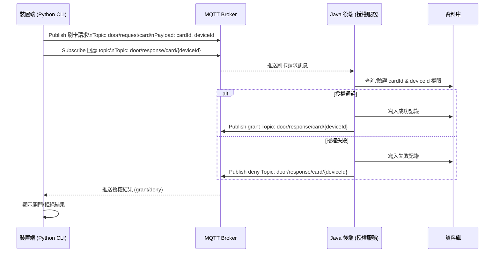
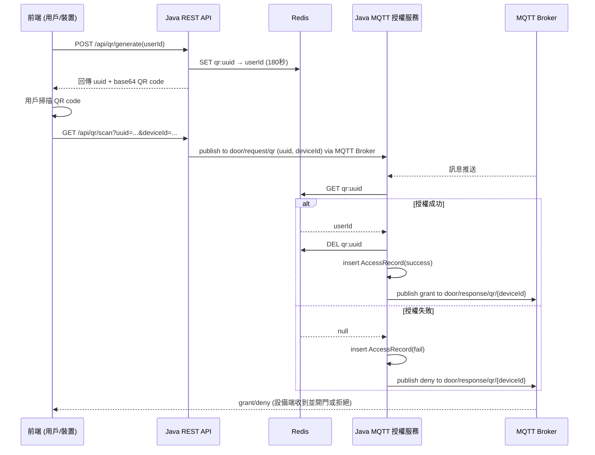

# 門禁系統裝置端模擬器（Card / QR 模式）

本專案提供一套以 Python 撰寫的門禁裝置端模擬器，支援兩種驗證情境：「刷卡」與「QR 掃碼」。
刷卡模式：裝置端模擬器主動發送刷卡授權請求至 MQTT broker，並訂閱專屬回應主題，及時接收授權結果（開門／拒絕）。
QR模式：裝置端僅需訂閱專屬回應主題，等待伺服器端（由 Web API 處理 QR 授權驗證後）主動推送授權結果。
兩種模式皆採用 MQTT Pub/Sub 架構，本專案透過「唯一 client_id 機制」與「專屬 topic 命名設計」，確保每台裝置連線與訊息完全隔離；
同時，QR code 驗證採 Redis 快取（qr:uuid → userId），授權一次即失效，能有效防止資訊混淆與資安風險，保障多裝置多用戶同時操作的安全性與正確性。
本模擬器適用於門禁系統開發、功能測試與流程展示，亦有助於後續軟硬體整合與自動化驗證作業。

## 環境需求

## 使用方式
### 1. 啟動 MQTT Broker
請先確認你的開發環境中已啟動 MQTT broker。

## 執行模擬裝置
### 1. 模擬刷卡模式，須確保VM上可執行Docker指令
```bash
docker exec acs-simulator python device_mqtt.py --mode card --cardId=U123 --deviceId=device-001
```

### 3. 參數說明
| 參數名稱         | 說明                         | 範例值          |
| ------------ | -------------------------- | ------------ |
| `--mode`     | 模擬模式（必填）`card`         | `card`       |
| `--cardId`   | 卡片 ID，**僅 `card` 模式需填**    | `123456789`  |
| `--deviceId` | 裝置編號（選填，預設為 `device-001`）  | `device-001` |


## 程式邏輯簡介
### 1. 裝置發送授權請求 
根據模式產生對應的 MQTT Topic 與 Payload，發送至伺服器。

| 模式 | Request Topic           | Response Topic                  | Payload 範例                             |
| -- |-------------------------| ------------------------------- | -------------------------------------- |
| 卡片 | `door/request/card`     | `door/response/card/{deviceId}` | `cardId:123456789,deviceId:device-001` |
| QR | `（本專案QR code為被動接受回應角色）` | `door/response/qr/{deviceId}`   | `uuid:9876-ABCD,deviceId:device-002`   |


### 2. 裝置訂閱伺服器授權回應
裝置會訂閱個別的回應 topic，主機端應該回傳以下授權訊息之一：
- grant：授權通過，模擬開門
- deny：授權失敗，拒絕進入

## MQTT架構簡述
本模擬器採用 MQTT 的 Pub/Sub 架構：

* 裝置端（此腳本）
    * Publish：
      * 刷卡模式：送出授權請求
        * door/request/card（刷卡模式）
      * QR模式：送出授權請求
        * door/request/qr（QR 模式）

    * Subscribe：
      * 只會收到自己裝置的回應（刷卡模式）
        * door/response/card/{deviceId}
      * 只會收到自己裝置的回應（QR模式）    
        * door/response/qr/{deviceId}

* 伺服器端（Java Spring Boot）
    * Subscribe
      * 接收所有裝置刷卡請求
        * door/request/card
      * 接收所有裝置QR請求
        * door/request/qr

    * Publish：
      * 授權結果至對應的回應 topic


## 刷卡時序圖



## 一次性QR Code授權時序圖

